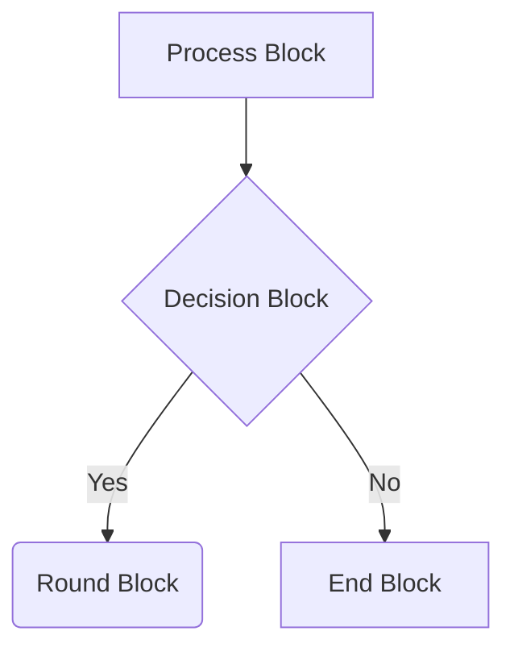

# Import Functionality Guide

## Overview
Milestone 6 adds comprehensive import functionality to the Fusion System Blocks add-in, allowing users to create diagrams from external sources including Mermaid flowcharts and CSV data.

## Features

### Mermaid Flowchart Import
Import diagrams from Mermaid flowchart syntax with support for:
- Node definitions with different shapes and types
- Connection arrows with labels
- Automatic positioning and layout
- Type detection based on Mermaid node shapes

**Supported Syntax:**


**Node Types:**
- `[text]` → Generic blocks
- `{text}` → Decision blocks  
- `(text)` → Process blocks

### CSV Data Import
Import structured diagram data from CSV format:

**Blocks CSV Format:**
```csv
name,type,x,y,status,voltage,current,notes
Power Supply,PowerSupply,100,100,Verified,12V,2000mA,Main power
Microcontroller,Microcontroller,300,100,Planned,3.3V,200mA,ARM Cortex-M4
```

**Connections CSV Format:**
```csv
from,to,kind,protocol,notes
Power Supply,Microcontroller,electrical,12V DC,Main power
Microcontroller,LED,electrical,Digital GPIO,Status indicator
```

## Validation
All imported diagrams are validated against:
- JSON schema compliance
- Business rules (unique block names, valid connections)
- Interface compatibility
- Data integrity checks

## Usage

1. **Open Import Dialog**: Click the "Import" button in the toolbar
2. **Choose Format**: Select either "Mermaid Flowchart" or "CSV Data"
3. **Input Data**: 
   - For Mermaid: Paste flowchart text
   - For CSV: Enter blocks CSV (required) and connections CSV (optional)
4. **Import**: Click "Import" to parse and validate
5. **Review**: Imported diagram replaces current diagram after validation

## Examples
See the `examples/` directory for:
- `sample_mermaid.md` - Example Mermaid flowchart
- `sample_blocks.csv` - Example blocks data
- `sample_connections.csv` - Example connections data

## Architecture

### Backend (Python)
- `parse_mermaid_flowchart()` - Regex-based Mermaid parser
- `import_from_csv()` - CSV parser with attribute preservation
- `validate_imported_diagram()` - Validation pipeline

### Frontend (JavaScript)
- Import dialog with tabbed interface
- Real-time validation feedback
- Error handling and user messaging

### Integration
- Message passing between Python backend and JavaScript frontend
- Schema validation before diagram loading
- Automatic position generation for imported elements

## Testing
Comprehensive test suite covering:
- Mermaid parsing edge cases
- CSV import with various formats
- Validation scenarios
- Error handling
- Complex diagram structures

Run tests: `pytest tests/test_import.py -v`